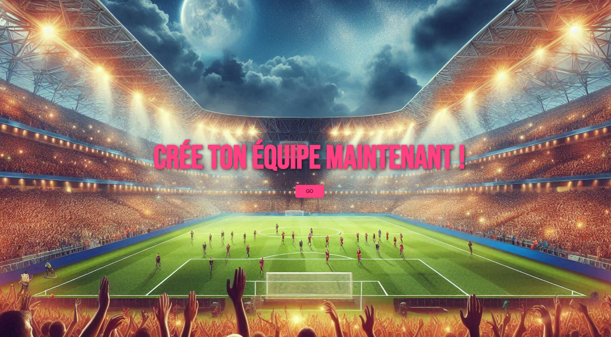

# ⚽️ Mon Onze de Légende

Une application web Vue.js permettant de sélectionner un 11 de légende sur un terrain interactif, avec photo des joueurs, rôles personnalisables, et export en PNG.

## Technologies

### Web app

#### Front-end

- Vue.js 3 + Vite
- Axios (API requests)
- html2canvas (Pour la capture du terrain)

#### Back-end

- Node.js (Express)
- Cors

#### APIs

- Api-Football (https://www.api-football.com)

---

## Lancer le projet

### Back-end

```bash
cd backend
npm install
node index.js
```

### Crée un fichier .env avec ta clé API (S'enregister sur https://www.api-football.com)

```bash
API_KEY=ta_clé_api
```

### Front-end

```bash
cd frontend
npm install
npm run dev
```

### Crée ton equipe et partage ta compo !

---

## Contact

- [Morgan](https://github.com/Morg92b)
